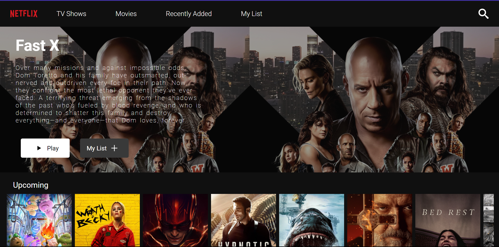

# Clone of Netflix Platform

## => This is a Clone of Netflix-Platform built with React and Movie-API. It's homepage showcases a visually appealing and intuitive interface, featuring a layout that is familiar to Netflix users.

## Website Link => https://mk-netflix-clone.netlify.app/

## Project's Screenshots =>




<h2>Getting Started</h2>

1. To get started with this react project, you will need to have `Node.js` and `NPM` installed on your system.

2. First, you need to open a `Terminal` in your system and `Clone` this repository by using :

```bash
git clone https://github.com/Mk4Levi/Netflix-Clone-mk.git
```

3. Navigate to the Project's directory :

```bash
cd Netflix-Clone-mk
```

4. Install all Dependencies used in this Project :

```bash
npm install
```

5. Finally, host it on local server :

```bash
npm run start
```

6. Now just search this link in your browser to view the live running application in your Local sysytem :

```bash
http://localhost:3000
```

<h2>Paths & Files</h2>

### Structure of the Folders & Files in this Repo :

```text
.
├── public/
├── src
│   ├── assets/
│   ├── components/
|         └──Navbar.jsx
│         └──PreLoader.jsx
│         └──index.js
│
│   ├── config/
|         └──firebaseConfig.js
│         └──index.js
│
│   ├──  scss/
|         └──App.scss
│         └──Home.scss
│         └──PreLoader.css
│
│   ├── components/
|         └──Home.jsx
|         └──index.js
|
│   ├── App.jsx
│   ├── index.jsx
│   ├── vercel.json
│
├── .eslintrc.json
├── .gitattributes
├── .gitignore
├── index.html
├── package-lock.json
├── package.json
├── README.md

```

# Thank You
